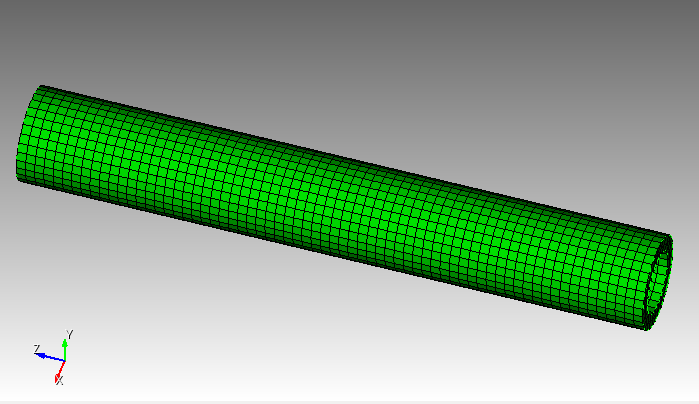

# For ASME-2021-paper
Run with `Python3`. It appears `python2` does not support `subprocess`

`tube_bash-maker.py` writes the executable `NH_runs.sh` bash file. `NH_runs.sh` runs `FSInitial-NH1`,`FSInitial-NH1`,`FSCurrent-NH1`, and `FSCurrent-NH2` with polynomials of order 1-4 on the tube mesh under `h-p-study` folder. The mesh used is `Tube8_25int_1.exo` with 16 processors. Every problem is run 3 times.

`NH_runs.sh` file is run on Noether.

`log_files_NH_16_cpu` folder contains the raw data for all 48 runs.

Bending the tube in the `-Y` direction by `20mm` was performed. The tube is `100mm`

